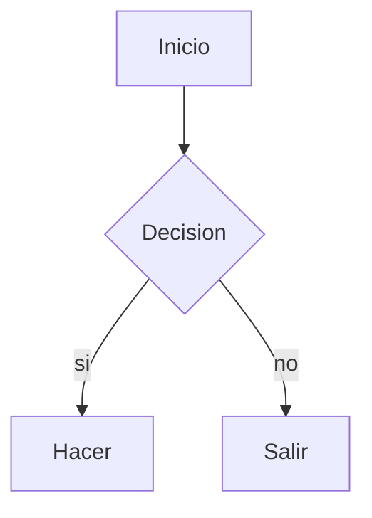

# Documento de prueba

Texto con **negrita**, *cursiva*, ~~tachado~~, `codigo` y un [link externo](https://example.com).

## Formulas

Inline: $E = mc^2$ y en bloque:

$$
\int_0^1 x^2 \, dx = \frac{1}{3}
$$

## Diagrama



## Codigo

```python
def saludar(nombre: str) -> str:
    return f"hola {nombre}"
```

## Tabla

| columna | valor | nota |
|---------|------:|:----:|
| alfa    |    10 |  ok  |
| beta    |   200 |  --  |

## Listas

- [ ] pendiente
- [x] hecho
- item normal
  - anidado

## Cita y detalles

> Una cita que ocupa
> dos lineas.

<details><summary>Desplegable</summary>Contenido oculto.</details>

<p align="center"><strong>HTML crudo permitido</strong></p>

<script>window.pwned = true;</script>

## Imagenes


## Notas

Referencia[^1]

[^1]: La nota al pie.

## Duplicado
### Duplicado
